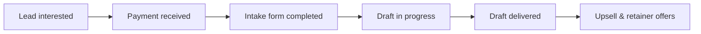

## Client Workflow SOP – Summit Grant Solutions

This SOP defines the end-to-end journey from first “yes” to upsell/retainer. Use it yourself or hand it to an assistant.

---

## 1. Trigger – Lead Says “Yes” or “Tell Me More”

**Channels:** Email, LinkedIn, Facebook, etc.  
**Goal:** Move from interest → payment quickly and clearly.

### 1.1 Standard Response After Interest

When a lead replies positively:

> Thanks so much, {{first_name}} – I’m excited about what you’re building at {{business_name}}.  
>  
> Here’s how the **$99 Amber Grant draft** works in practice:  
> 1. You complete a short intake form about your story, goals, and how you’d use the $10k.  
> 2. I turn that into a **submission-ready Amber Grant application draft** in 24–48 hours.  
> 3. You copy/paste the answers into the official Amber Grant portal and pay their small fee.  
>  
> To get started, there are two quick steps:  
> \- Secure payment link: {{stripe_link_amber_99}}  
> \- Intake form: {{intake_form_link}}  
>  
> Once your payment and form are in, I’ll confirm your spot and share your expected delivery date.

Then wait for payment.

---

## 2. Payment Stage

**Tools:** Stripe/Airwallex + Zapier + Client tracking sheet/Notion.

### 2.1 Manual Flow (No Automation Yet)

1. Lead confirms they want to proceed.
2. Send the correct **payment link**:
   - Basic Amber Grant draft → `$99` link
   - Premium / multiple grants → `$199` or `$299` link
3. When Stripe/Airwallex confirms payment:
   - Manually create/update the client in your tracking sheet:
     - Name, business, email, package type, date of purchase.
   - Send the **“Thank you + Intake Form”** email (see below).

### 2.2 “Thank You + Intake Form” Email

> Subject: Welcome – Amber Grant draft for {{business_name}}  
>  
> Hi {{first_name}},  
>  
> Thank you for your payment – I’m excited to work on your Amber Grant application.  
>  
> The next step is simple: please fill out this short intake form so I can tell your story in your own words:  
> **Intake form:** {{intake_form_link}}  
>  
> It usually takes about 10–15 minutes. Once it’s submitted, I’ll send you a quick confirmation and a delivery window (typically **24–48 hours**).  
>  
> If you get stuck on any question, you can leave a note and I’ll help you shape the answer.  
>  
> Best,  
> {{sender_name}}  
> Summit Grant Solutions

---

## 3. Intake Form Stage

**Tool:** Google Forms (or similar).

### 3.1 Required Questions (Minimum)

Design your form to capture:

- Basic info:
  - Business name
  - Website
  - Location (city, state)
  - Years in business
  - Number of employees
- Owner story:
  - How did you start the business?
  - What does your business mean to you / your community?
- Current situation:
  - Biggest challenges right now
  - Recent milestones or successes
- Grant-specific:
  - How would you use $10,000 in the next 6–12 months?
  - What change would that make for you, your team, or your community?

### 3.2 After Form Submission

1. Check new responses daily (or use Zapier to notify you).
2. Update the client record:
   - `Intake Form Status` → Completed
   - Note the date/time.
3. Send a **confirmation email**:

> Subject: Got your Amber Grant intake – next steps  
>  
> Hi {{first_name}},  
>  
> I’ve received your intake form – thank you for the thoughtful answers.  
>  
> I’ll now turn this into a **submission-ready Amber Grant application draft**. My goal is to deliver your draft by **{{delivery_date}}** (usually within 24–48 hours).  
>  
> You’ll receive your draft as a document you can review, and then copy/paste into the Amber Grant portal.  
>  
> Talk soon,  
> {{sender_name}}

---

## 4. Drafting Stage

**Tools:** AI model (Claude/Grok/etc.), your internal prompts, and a doc editor (Google Docs or Word).

### 4.1 Draft Creation

1. Open the client’s intake answers.
2. Paste them into your **standard Amber Grant prompt** (with Summit Grant system instructions).
3. Generate a first draft via AI.
4. Manually edit to:
   - Tighten the story
   - Clarify their goals and use of funds
   - Align with Amber Grant guidelines
   - Keep tone warm, honest, grounded

### 4.2 Internal Checklist Before Delivery

- [ ] All required questions are answered
- [ ] No obviously wrong facts (double-check names, dates, numbers)
- [ ] Word count within reasonable limits for the program
- [ ] Tone matches Summit Grant’s style (encouraging, professional)

Mark `Draft Status` in your tracking sheet:

- `Not Started` → `In Progress` → `Ready to Deliver`

---

## 5. Delivery Stage

**Goal:** Deliver a clean, easy-to-use document plus simple instructions.

### 5.1 Delivery Email

> Subject: Your Amber Grant draft for {{business_name}}  
>  
> Hi {{first_name}},  
>  
> Attached is your **submission-ready Amber Grant application draft** for {{business_name}}.  
>  
> Inside you’ll see:  
> \- Answers to each of the main application questions  
> \- Your story, goals, and use of funds woven into a clear narrative  
>  
> **How to submit:**  
> 1. Go to the official Amber Grant website and open the application form.  
> 2. Copy/paste each answer from the document into the matching question field.  
> 3. Review everything once more in your own words and make any small edits you like.  
> 4. Pay the Amber Grant application fee and click submit.  
>  
> If anything feels off or you’d like a small tweak to better match your voice, just hit reply and I’m happy to adjust.  
>  
> Wishing you the best outcome with this application.  
>  
> Warmly,  
> {{sender_name}}  
> Summit Grant Solutions

Update the tracking sheet:

- `Draft Status` → `Delivered`

---

## 6. Upsell & Retainer Stage

### 6.1 Immediate Upsell (After Delivery)

1–2 days after delivery, send:

> Subject: Other grants that fit {{business_name}}  
>  
> Hi {{first_name}},  
>  
> Now that your Amber Grant draft is ready, there are a few **other private grants** that often fit women-owned food/retail businesses like {{business_name}} – for example, **Hello Alice**, **IFundWomen**, and a few retail-focused programs.  
>  
> If you’d like, I can:  
> \- Flag 1–2 additional grants that match your business, and  
> \- Adapt your current Amber Grant narrative to those programs.  
>  
> I offer this as a **Premium Draft** option (usually **$199–$299**, depending on the number of grants).  
>  
> Would you like me to take a look and suggest the best next grant for you?  
>  
> Best,  
> {{sender_name}}

### 6.2 Retainer Offer (After First Good Experience or First Win)

> Subject: Ongoing grant help for {{business_name}}  
>  
> Hi {{first_name}},  
>  
> As you’ve seen, private grants can be a powerful way to fund growth without loans or investors. New grant rounds for women-owned businesses open throughout the year.  
>  
> If you’d like a more hands-off way to stay on top of them, I offer a **monthly retainer**:  
> \- I monitor relevant private grant opportunities for {{business_name}}  
> \- You get **1–2 submission-ready drafts per month** included  
> \- Priority turnaround and support on each application  
>  
> Pricing usually starts around **$199–$399/month**, depending on volume.  
>  
> If that’s something you’d like to explore, I can suggest a simple plan based on your goals for the next 6–12 months.  
>  
> Best,  
> {{sender_name}}

Record in tracking sheet:

- `Upsell Status`:
  - `Not Offered` / `Offered` / `Accepted Premium` / `Accepted Retainer` / `Declined`

---

## 7. High-Level Flow Diagram

This SOP completes the “define client workflow” part of the plan: you now have a clear, repeatable path from first “yes” through delivery and upsell.

